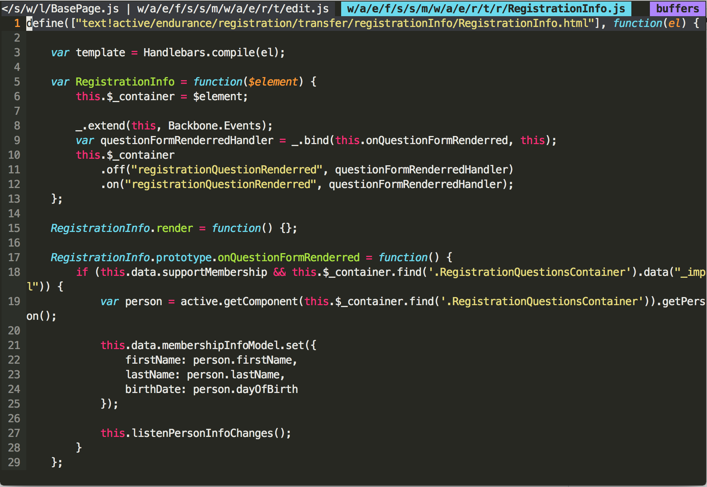
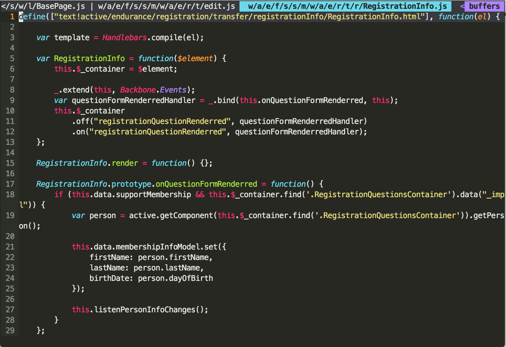

vim-javascript-lib
==================

This is a companion plugin of [vim-javascript](https://github.com/pangloss/vim-javascript), which provide the keyword highlight of famous js libraries and start to support native methods. This plugin will not try to highlight every method of the libs, it only highlight most frequent used __global variables__, such as *_*, *$*, *Backbone*, because __sometimes the more you see the less you get__, we just care the most important stuff here.

Install
-------

### Install with [Vundle](https://github.com/gmarik/Vundle.vim)

    Plugin 'crusoexia/vim-javascript-lib'

Dependency
----------

This plugin is designed to work with [vim-javascript](https://github.com/pangloss/vim-javascript), so [vim-javascript](https://github.com/pangloss/vim-javascript) is hard dependency, you must install it to make the plugin works.

JS native highlight
-------------------

* Array methods

Libraries
---------

Right now the list is:

* underscore / Lo-Dash
* jQuery / Zepto
* Backbone
* angular
* Handlebars / Mustache
* mocha
* AMD
* Q

HTML
----

This plugin will also fix the html attribute highlight issue of original vim.

Screenshots
-----------

### Before:

### After:

